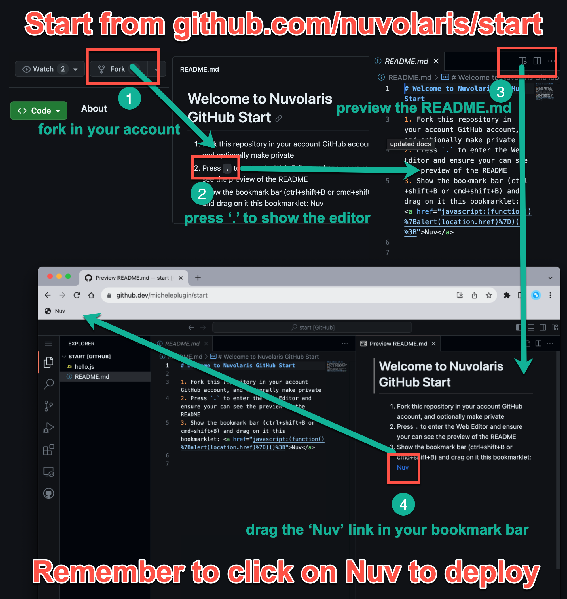

# Welcome to Nuvolaris GitHub Start

1. Fork this repository in your account GitHub account. You can also rename it and make private.
2. Press `.` to enter the Editor.
3. If the README.md is not showing the image, click on the "preview" button to show it and the Nuv link.
4. Show the bookmark bar (Chrome: ⫶ → Bookmarks → Show Bookmarks Bar) and drag following link on the bar: <a href="javascript:(function()%7Balert(location.href)%7D)()%3B">Nuv</a>

# Remember: click on the Nuv link to deploy

